# Análisis del Proyecto – Agenda360 Lite
1\. Contexto y objetivos del proyecto
-------------------------------------

### Objetivo general

Construir **Agenda360 Lite**, una app móvil de agenda de citas para negocios pequeños (barbería, consultorio, freelancer), con:

*   App Android en **Kotlin + Jetpack Compose** ✅ (requisito del profe).
    
*   Backend en **Kotlin (Ktor)** ✅
    
*   Base de datos **MySQL** en el backend + **Room** en el móvil.
    
*   Autenticación con **JWT**.
    
*   Consumo de **API REST (JSON)**.
    
*   Uso de **geolocalización** y **cámara**.
    
*   Mínimo **5 pantallas** con navegación.
    
*   Todo estructurado con buenas prácticas (MVVM, capas, DI, etc.).
    

2\. Sistema completo: visión de alto nivel
------------------------------------------

Piensa en 3 grandes bloques:

1.  **Cliente móvil (Android app)**
    
    *   Hecha en Kotlin, Compose.
        
    *   Consume API REST.
        
    *   Guarda una copia local de datos en Room.
        
    *   Guarda JWT y preferencias en DataStore.
        
    *   Usa sensores (cámara, ubicación).
        
2.  **API Backend (Ktor)**
    
    *   Hecha en Kotlin.
        
    *   Expone endpoints REST en JSON:
        
        *   /auth/login, /auth/register (si quieres),
            
        *   /clients, /services, /appointments.
            
    *   Genera y valida **JWT**.
        
    *   Accede a **MySQL** para datos persistentes.
        
3.  **Base de datos MySQL**
    
    *   Tablas: users, clients, services, appointments.
        

3\. Mapeo a los criterios del profe

### Diagrama de arquitectura (alto nivel)

```mermaid
flowchart LR
    A[Android App\nKotlin + Compose] -- REST/JSON --> B[Ktor API\nAuthentication JWT]
    B --> C[(MySQL DB)]
    A <-- JWT en DataStore --> A2[JwtInterceptor\nOkHttp]
    A <-- Cache local --> A3[Room Database]
    A3 <-- Sincronización --> B
```


-----------------------------------

*   **Kotlin + Jetpack Compose**→ App Android con Compose para todas las pantallas.
    
*   **Manejo de archivos JSON o base de datos con servicios REST**→ API Ktor devuelve y recibe JSON (Retrofit en la app) + MySQL en backend + Room en la app.
    
*   **Geolocalización**→ Al crear una cita: tomar ubicación del lugar de la cita y guardarla (lat, lon).
    
*   **Navegación ≥ 5 pantallas**
    
    *   Login
        
    *   Dashboard (resumen del día)
        
    *   Lista de citas
        
    *   Detalle de cita
        
    *   Formulario nueva/editar cita
        
    *   Perfil/Configuración
        
*   **Uso de cámara**→ Foto del ticket / resultado del servicio asociada a la cita.
    
*   **Repositorio GitHub + README + APK**→ Estructura clara, README técnico, APK compilado.
    

4\. Análisis de dominio: actores y casos de uso
-----------------------------------------------

### Actor principal

*   **Usuario del negocio** (OWNER o EMPLOYEE)
    
    *   No vamos a hacer un RBAC súper complicado en la app; roles se pueden reflejar sólo en el backend si quieres.
        

### Casos de uso clave

1.  **Iniciar sesión**
    
    *   Usuario ingresa email + contraseña.
        
    *   App envía credenciales a /auth/login.
        
    *   Backend valida, genera **JWT**.
        
    *   App guarda JWT en DataStore.
        
2.  **Ver dashboard del día**
    
    *   App llama a /appointments?date=hoy.
        
    *   Muestra citas de hoy, cantidad por estado.
        
3.  **Gestionar clientes**
    
    *   Listar clientes (GET /clients).
        
    *   Crear/editar/borrar clientes (POST/PUT/DELETE /clients).
        
    *   App guarda clientes en Room.
        
4.  **Gestionar servicios**
    
    *   Listar servicios (GET /services).
        
    *   Crear/editar/borrar servicios.
        
5.  **Gestionar citas**
    
    *   Crear cita (cliente, servicio, fecha/hora, notas).
        
    *   Tomar ubicación actual y asociar a la cita.
        
    *   Tomar foto (ticket, antes/después).
        
    *   Guardar en Room + enviar a backend (POST /appointments).
        
    *   Editar cita → actualizar estado (SCHEDULED, DONE, CANCELLED).
        
    *   Ver lista y detalle.
        
6.  **Ver perfil / cerrar sesión**
    
    *   Ver nombre/email del usuario.
        
    *   Botón “cerrar sesión” → borrar JWT + limpiar sesión local.
        

5\. Modelo de datos (entidades principales)
-------------------------------------------

### 5.1. User

*   id: Long
    
*   name: String
    
*   email: String (único)
    
*   passwordHash: String (en DB, no en app)
    
*   role: String (ej. "OWNER", "EMPLOYEE")
    

### 5.2. Client

*   id: Long
    
*   name: String
    
*   phone: String?
    
*   email: String?
    
*   notes: String?
    
*   ownerId: Long (usuario dueño del negocio, si quieres multi-user futuro)
    

### 5.3. Service

*   id: Long
    
*   name: String
    
*   durationMinutes: Int
    
*   price: Double
    
*   description: String?
    
*   ownerId: Long
    

### 5.4. Appointment

*   id: Long
    
*   clientId: Long
    
*   serviceId: Long
    
*   userId: Long (quién atiende: barber, doctor, etc.)
    
*   dateTime: DateTime
    
*   status: String (SCHEDULED, DONE, CANCELLED)
    
*   locationLat: Double?
    
*   locationLon: Double?
    
*   photoUrl: String? (ruta en backend o path local en móvil)
    
*   notes: String?
    
*   createdAt: DateTime
    
*   updatedAt: DateTime
    

MySQL y Room pueden tener variaciones (por ejemplo, id autoincrement en DB, Long? en modelos Kotlin).

### 5.5. Esquema SQL inicial con índices (MySQL)

```sql
CREATE TABLE users (
  id BIGINT PRIMARY KEY AUTO_INCREMENT,
  name VARCHAR(100) NOT NULL,
  email VARCHAR(150) NOT NULL UNIQUE,
  password_hash VARCHAR(255) NOT NULL,
  role VARCHAR(20) NOT NULL,
  created_at TIMESTAMP NOT NULL DEFAULT CURRENT_TIMESTAMP,
  updated_at TIMESTAMP NOT NULL DEFAULT CURRENT_TIMESTAMP ON UPDATE CURRENT_TIMESTAMP
);

CREATE TABLE clients (
  id BIGINT PRIMARY KEY AUTO_INCREMENT,
  name VARCHAR(120) NOT NULL,
  phone VARCHAR(30),
  email VARCHAR(150),
  notes TEXT,
  owner_id BIGINT,
  created_at TIMESTAMP NOT NULL DEFAULT CURRENT_TIMESTAMP,
  updated_at TIMESTAMP NOT NULL DEFAULT CURRENT_TIMESTAMP ON UPDATE CURRENT_TIMESTAMP,
  INDEX idx_clients_owner (owner_id),
  FOREIGN KEY (owner_id) REFERENCES users(id)
);

CREATE TABLE services (
  id BIGINT PRIMARY KEY AUTO_INCREMENT,
  name VARCHAR(120) NOT NULL,
  duration_minutes INT NOT NULL,
  price DECIMAL(10,2) NOT NULL,
  description TEXT,
  owner_id BIGINT,
  created_at TIMESTAMP NOT NULL DEFAULT CURRENT_TIMESTAMP,
  updated_at TIMESTAMP NOT NULL DEFAULT CURRENT_TIMESTAMP ON UPDATE CURRENT_TIMESTAMP,
  INDEX idx_services_owner (owner_id),
  FOREIGN KEY (owner_id) REFERENCES users(id)
);

CREATE TABLE appointments (
  id BIGINT PRIMARY KEY AUTO_INCREMENT,
  client_id BIGINT NOT NULL,
  service_id BIGINT NOT NULL,
  user_id BIGINT NOT NULL,
  date_time DATETIME NOT NULL,
  status ENUM('SCHEDULED','DONE','CANCELLED') NOT NULL,
  location_lat DOUBLE,
  location_lon DOUBLE,
  photo_url VARCHAR(255),
  notes TEXT,
  created_at TIMESTAMP NOT NULL DEFAULT CURRENT_TIMESTAMP,
  updated_at TIMESTAMP NOT NULL DEFAULT CURRENT_TIMESTAMP ON UPDATE CURRENT_TIMESTAMP,
  INDEX idx_appt_client (client_id),
  INDEX idx_appt_service (service_id),
  INDEX idx_appt_user (user_id),
  INDEX idx_appt_date (date_time),
  FOREIGN KEY (client_id) REFERENCES clients(id),
  FOREIGN KEY (service_id) REFERENCES services(id),
  FOREIGN KEY (user_id) REFERENCES users(id)
);
```

6\. Arquitectura backend (Ktor + MySQL + JWT)
---------------------------------------------

### Capas y responsabilidades
```text
backend-ktor/
  └─ src/main/kotlin/com/tuempresa/agenda360/backend/
       ├─ Application.kt        # arranque Ktor
       ├─ config/
       │   ├─ DatabaseConfig.kt # conecta a MySQL
       │   └─ JwtConfig.kt      # configura secret, issuer, etc.
       ├─ domain/
       │   ├─ model/            # modelos / entidades de dominio
       │   └─ enums/
       ├─ dto/                  # LoginRequest, AppointmentResponse, etc.
       ├─ repository/           # acceso a MySQL (Exposed / SQL)
       ├─ service/              # lógica de negocio
       └─ routes/               # rutas Ktor (endpoints)
```

### Flujo típico en el backend

1.  routes/AuthRoutes.kt define /auth/login.
    
2.  Recibe LoginRequest(email, password).
    
3.  Llama a AuthService.login(...).
    
4.  AuthService usa UserRepository para buscar al usuario.
    
5.  Valida contraseña → genera JWT con JwtConfig.
    
6.  Devuelve LoginResponse(token, userInfo).
    

Para citas, clientes, servicios es igual: routes → service → repository → DB.

### Diagrama de secuencia: Login

```mermaid
sequenceDiagram
  participant App as Android App
  participant API as Ktor API
  participant DB as MySQL

  App->>API: POST /api/v1/auth/login {email,password}
  API->>DB: Buscar usuario por email
  DB-->>API: User(passwordHash)
  API->>API: Verificar contraseña (bcrypt/argon2)
  API->>API: Generar JWT (sub=userId, exp)
  API-->>App: 200 {token, user}
  App->>App: Guardar token en DataStore
  App->>API: GET /api/v1/clients (Authorization: Bearer)
```



### Diagrama de secuencia: Crear cita


### 6.1. Contrato de API v1

- Base: `/api/v1`
- Endpoints:
  - `POST /auth/login`
  - `GET /clients?limit=&offset=`
  - `POST /clients`, `PUT /clients/{id}`, `DELETE /clients/{id}`
  - `GET /services?limit=&offset=`
  - `POST /services`, `PUT /services/{id}`, `DELETE /services/{id}`
  - `GET /appointments?date=YYYY-MM-DD` (UTC)
  - `POST /appointments`, `PUT /appointments/{id}`, `DELETE /appointments/{id}`

- Envelope estándar:
```json
{
  "data": { },
  "error": null,
  "message": "OK"
}
```
- Errores: `400/401/403/404/409/500` con mensajes homogéneos.
- Fechas: ISO 8601 en UTC (`yyyy-MM-dd'T'HH:mm:ss'Z'`).

### 6.2. Seguridad y fechas/UTC

- Contraseñas: `bcrypt` o `argon2` con `salt` y `work factor`.
- JWT: expiración 30–60 min; `sub` = `userId`; validar `issuer/audience`.
- Forzar UTC en servidor y normalizar fechas en app.

### 6.3. Infraestructura Docker Compose (MySQL)

```yaml
version: "3.8"
services:
  db:
    image: mysql:8
    environment:
      MYSQL_DATABASE: agenda360
      MYSQL_USER: agenda_user
      MYSQL_PASSWORD: agenda_pass
      MYSQL_ROOT_PASSWORD: root_pass
    ports:
      - "3306:3306"
    volumes:
      - ./db/init.sql:/docker-entrypoint-initdb.d/init.sql
```

7\. Arquitectura mobile (Android app)
-------------------------------------

### Patrones y capas

Usaremos **MVVM + Clean ligero**:
```text
android-app/
  └─ app/src/main/java/com/tuempresa/agenda360lite/
       ├─ core/
       │   ├─ network/        # Retrofit, JwtInterceptor
       │   ├─ database/       # AppDatabase (Room), DAOs
       │   ├─ datastorage/    # DataStore (JWT)
       │   ├─ di/             # módulos Hilt (provides)
       │   └─ util/           # utilidades
       ├─ auth/
       │   ├─ data/           # AuthApi, AuthRepositoryImpl
       │   ├─ domain/         # User model, LoginUseCase
       │   └─ ui/             # LoginViewModel, LoginScreen (@Composable)
       ├─ clients/
       ├─ services/
       ├─ appointments/
       │   ├─ data/           # local + remote + repos
       │   ├─ domain/         # modelos dominio + usecases
       │   └─ ui/             # Dashboard, lista, detalle, formulario
       ├─ location/
       ├─ camera/
       ├─ profile/
       ├─ navigation/         # NavGraph, Destinations
       └─ MainActivity.kt
```

### Flujo típico en la app

Ejemplo: crear cita

1.  Usuario abre AppointmentFormScreen.
    
2.  Compose manda eventos al AppointmentFormViewModel (ej. OnClientSelected, OnSaveClicked).
    
3.  ViewModel invoca CreateAppointmentUseCase.
    
4.  Use case llama a AppointmentRepository.createAppointment(...).
    
5.  Repository:
    
    *   Guarda cita en Room.
        
    *   Llama a API (AppointmentApi.createAppointment(...)).
        
    *   Maneja errores y sincronización.
        
6.  ViewModel actualiza UiState (Loading → Success/Error).
    
7.  UI muestra snackbar o navega a otra pantalla.
    

8\. Fases de desarrollo (pensando como ingeniero senior y usando IA)

### Diagrama de navegación (NavGraph Compose)

```mermaid
flowchart LR
  login((login)) --> dashboard((dashboard))
  dashboard --> appointments((appointments))
  appointments --> appointmentDetail((appointmentDetail/{id}))
  appointments --> appointmentForm((appointmentForm))
  dashboard --> profile((profile))
```

### Flujo de datos offline-first


--------------------------------------------------------------------

### 🔹 Fase 0 – Planeación y setup

Objetivo: tener todo claro antes de escribir código.

*   Definir oficialmente:
    
    *   Entidades y relaciones (ya lo hicimos en gran parte).
        
    *   Pantallas y sus acciones.
        
*   Crear repositorio en GitHub:
    
    *   agenda360-lite/
        
    *   Subcarpetas vacías: backend-ktor/, android-app/.
        
*   Crear primer borrador del README.md:
    
    *   Descripción del proyecto,
        
    *   Tecnologías,
        
    *   Estructura general (se irá llenando).
        

👉 Aquí puedes usar IA (ChatGPT/Tre) para generar texto inicial del README, diagrama Mermaid, etc.

### 🔹 Fase 1 – Backend mínimo Ktor + MySQL + Auth

Objetivo: tener un backend funcional básico para probar login desde Postman.

**Tareas:**

1.  Crear proyecto backend-ktor (Kotlin/JVM + Gradle).
    
2.  Agregar dependencias de:
    
    *   Ktor (core, netty, auth, auth-jwt, content-negotiation),
        
    *   MySQL driver,
        
    *   Exposed (opcional).
        
3.  Configurar conexión MySQL (DatabaseConfig.kt).
    
4.  Crear modelo User, tabla en MySQL, UserRepository.
    
5.  Implementar JwtConfig.
    
6.  Crear AuthRoutes.kt con POST /auth/login.
    
7.  Probar con Postman:
    
    *   Enviar email/password,
        
    *   Recibir JWT válido.
        

👉 IA puede ayudarte generando snippets Ktor, endpoints, manejo de errores.

### 🔹 Fase 2 – Backend CRUD de clientes, servicios, citas

Objetivo: API completa de dominio.

**Tareas:**

1.  Crear tablas y modelos: Client, Service, Appointment.
    
2.  Repositorios: ClientRepository, ServiceRepository, AppointmentRepository.
    
3.  Servicios: ClientService, ServiceService, AppointmentService.
    
4.  Rutas:
    
    *   GET/POST/PUT/DELETE /clients
        
    *   GET/POST/PUT/DELETE /services
        
    *   GET/POST/PUT/DELETE /appointments
        
    *   Filtros por fecha en /appointments.
        
5.  Probar todo con Postman:
    
    *   Incluyendo JWT en header Authorization.
        

### 🔹 Fase 3 – Android app: estructura base + navegación

Objetivo: tener el esqueleto de la app, pantallas vacías, navegación funcionando.

**Tareas:**

1.  Crear proyecto android-app con:
    
    *   Kotlin, Compose, Navigation, Hilt, Room, Retrofit.
        
2.  Configurar Hilt (Application class, Hilt modules vacíos).
    
3.  Crear NavGraph con rutas:
    
    *   "login", "dashboard", "appointments", "appointmentDetail/{id}", "appointmentForm", "profile".
        
4.  Crear screens vacías con textos.
    
5.  Verificar navegación (sin backend aún).
    

### 🔹 Fase 4 – Android: Auth + JWT (conectando al backend)

Objetivo: login real con la API Ktor.

**Tareas:**

1.  Crear AuthApi y modelos LoginRequest, LoginResponse.
    
2.  Configurar Retrofit baseUrl (ej. http://10.0.2.2:8080).
    
3.  AuthRepositoryImpl que llame a AuthApi.login.
    
4.  LoginUseCase + LoginViewModel + LoginScreen.
    
5.  Guardar JWT y datos de usuario en DataStore.
    
6.  Configurar JwtInterceptor y agregarlo a Retrofit.
    

**Pruebas:**

*   Iniciar sesión desde el emulador → ver en logs que recibes token.
    
*   Llamar a un endpoint protegido usando Retrofit con el token.
    

### 🔹 Fase 5 – Android: CRUD básico de citas, clientes, servicios

Objetivo: tener el flujo principal de negocio funcionando.

**Tareas:**

1.  Modelos de dominio + entidades Room (ClientEntity, ServiceEntity, AppointmentEntity).
    
2.  AppDatabase y DAOs.
    
3.  APIs: ClientApi, ServiceApi, AppointmentApi.
    
4.  Repositorios: ClientRepository, ServiceRepository, AppointmentRepository.
    
5.  Use cases:
    
    *   GetTodayAppointmentsUseCase
        
    *   GetAppointmentsByDateUseCase
        
    *   CreateAppointmentUseCase
        
    *   GetClientsUseCase, GetServicesUseCase
        
6.  ViewModels + screens:
    
    *   Dashboard (citas de hoy),
        
    *   Lista de citas,
        
    *   Formulario cita,
        
    *   Detalle cita.
        

**Pruebas:**

*   Crear citas desde la app, verlas reflejadas en MySQL (via backend).
    
*   Modificar citas y ver cambios en la app y DB.
    

### 🔹 Fase 6 – Geo + Cámara

Objetivo: cumplir los criterios “bonitos” del proyecto.

**Geo:**

*   Pedir permisos de ubicación (runtime).
    
*   Obtener lat/lon al crear cita.
    
*   Guardar en Appointment.
    
*   Mostrar en detalle (texto o link a Maps).
    

**Cámara:**

*   Pedir permiso de cámara.
    
*   Usar CameraX o Intent para tomar foto.
    
*   Guardar file path en Room (photoPath).
    
*   Mostrar miniatura en la pantalla de detalle.
    

### 🔹 Fase 7 – Pulido, UX, README, APK

*   Afinar UI (tema, colores, iconos).
    
*   Manejo de errores: sin internet, error backend, validaciones.
    
*   Completar README:
    
    *   Instrucciones de instalación backend + app.
        
    *   Arquitectura, flujos, tecnologías.
        
    *   Capturas de pantalla.
        
*   Generar APK.
    
*   Preparar presentación (guion + demo).

9\. Calidad y CI/CD
--------------------

- Backend: `gradle build test`, pruebas Ktor y publicación de JAR.
- Android: `./gradlew assembleDebug`, tests unitarios e instrumentados, publicar APK.
- Estilo/análisis: `ktlint`/`detekt` con chequeos en PR.
- Caché Gradle y artefactos en GitHub Actions.

Con esto tienes un **análisis completo**:

*   objetivo,
    
*   arquitectura,
    
*   entidades,
    
*   capas,
    
*   fases claras,
    
*   y cómo vamos a ir usando Kotlin en TODO el stack.
### Endpoints extendidos

- `GET /api/v1/appointments/availability?date=YYYY-MM-DD&serviceId=ID`: slots libres según `durationMinutes` y jornada (por defecto 09:00–18:00).
- `PUT /api/v1/appointments/{id}/status` con cuerpo `{status:"DONE|CANCELLED"}`.
- Listados de clientes y servicios: paginación/búsqueda en UI; backend retorna `data` y `meta`.

### Flujo tras login (app)

- Tras login, se navega a `dashboard`.
- Si no hay citas: estado vacío con opciones de refrescar/ver clientes/servicios.
