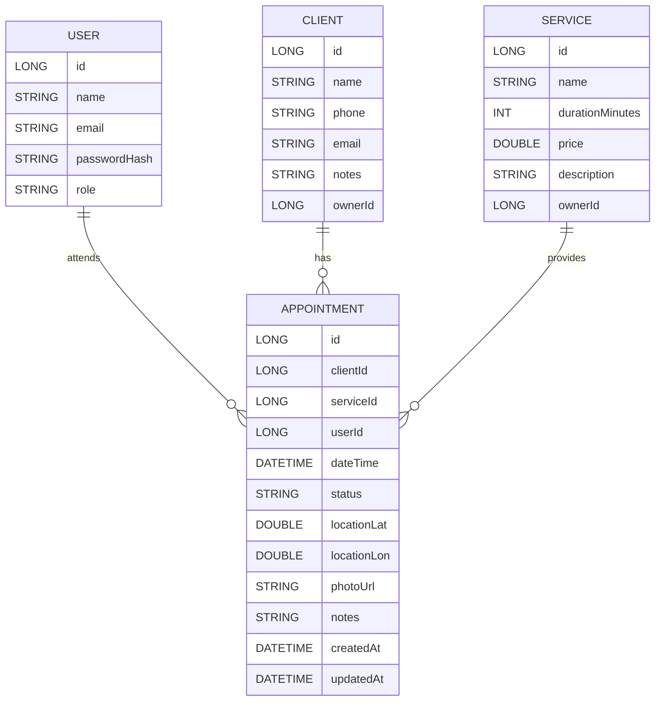
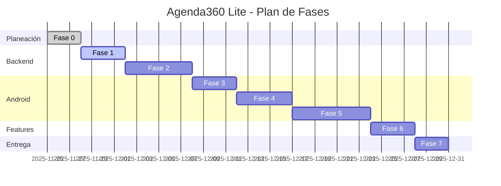

# Fases del Plan – Agenda360 Lite

FASE 0 – Definición, alcance y setup del repositorio
----------------------------------------------------

🎯 **Objetivo:** Tener claro qué vamos a hacer, cómo se llama todo, y dejar el repo listo.

### 0.1. Alcance funcional definitivo

*   Documentar (en un .md o en el README inicial):
    
    *   “Agenda360 Lite es una app móvil para gestionar citas de un negocio pequeño (barbería, consultorio, freelancer), con gestión de clientes, servicios y citas con ubicación y foto.”
        
    *   Casos de uso que SÍ tendrá:
        
        *   Login con usuario/contraseña (JWT).
            
        *   Ver citas del día (dashboard).
            
        *   Gestionar clientes (lista, crear/editar).
            
        *   Gestionar servicios (lista, crear/editar).
            
        *   Gestionar citas (lista, detalle, crear/editar).
            
        *   Adjuntar foto y ubicación a una cita.
            
        *   Cerrar sesión.
            
    *   Cosas que NO hará (para no scope creep):
        
        *   No pagos,
            
        *   No multi-negocio,
            
        *   No calendario complejo.

### 0.1.1. Convenciones técnicas (API y seguridad)

- Base path de API: `/api/v1`.
- Autenticación: `Authorization: Bearer <JWT>` con expiración de 30–60 min.
- Contraseñas: almacenar `passwordHash` (bcrypt o argon2 con `salt` y `work factor`).
- Fechas: ISO 8601 en UTC (`yyyy-MM-dd'T'HH:mm:ss'Z'`).
- Respuesta estándar:
```json
{
  "data": { },
  "error": null,
  "message": "OK"
}
```
- Errores: usar códigos `400/401/403/404/409/500` con mensajes homogéneos.
- Listados: soportar paginación y filtros (`limit`, `offset`, `date`).

### 0.2. Modelo de datos inicial (nivel conceptual)

*   Dibujar (aunque sea en texto o Mermaid) las entidades:
    
    *   User, Client, Service, Appointment + relaciones.
        
*   Definir campos principales (ya lo hicimos, pero aquí lo plasmas formal).



### 0.3. Repositorio GitHub

*   Crear repo: agenda360-lite.
    
*   agenda360-lite/ ├─ backend-ktor/ (vacío o con README) ├─ android-app/ (vacío o con README) └─ README.md
    
*   Primer commit: “chore: inicializar repositorio Agenda360 Lite”.

Infraestructura: Docker Compose (MySQL)

```yaml
version: "3.8"
services:
  db:
    image: mysql:8
    environment:
      MYSQL_DATABASE: agenda360
      MYSQL_USER: agenda_user
      MYSQL_PASSWORD: agenda_pass
      MYSQL_ROOT_PASSWORD: root_pass
    ports:
      - "3306:3306"
    volumes:
      - ./db/init.sql:/docker-entrypoint-initdb.d/init.sql
```

🧠 **IA aquí:**Puedes pedirle a la IA que te genere:

*   Un primer README con secciones vacías,
    
*   Un diagrama Mermaid de entidades.
    

FASE 1 – Backend base Ktor + MySQL + Auth mínima
------------------------------------------------

### Cronograma (Gantt de fases)



🎯 **Objetivo:** Tener un backend en Kotlin que se conecte a MySQL y permita login con JWT (sin aún manejar citas).

> Esta fase todavía no toca Android. Es puro servidor.

### 1.1. Crear proyecto backend-ktor

*   En IntelliJ / Android Studio:
    
    *   Crear proyecto Gradle Kotlin/JVM.
        
    *   Añadir dependencias en build.gradle.kts:
        
        *   ktor-server-core, ktor-server-netty
            
        *   ktor-server-auth, ktor-server-auth-jwt
            
        *   ktor-server-content-negotiation + kotlinx-serialization-json
            
        *   mysql-connector-j
            
        *   exposed-core, exposed-jdbc, exposed-dao (si usas Exposed)
            
        *   logback-classic (logging)
            

### 1.2. Configuración de aplicación

*   Application.kt:
    
    *   Función main que levante Ktor en un puerto (ej. 8080).
        
    *   Módulos Ktor:
        
        *   install(ContentNegotiation) con JSON,
            
        *   install(CallLogging),
            
        *   install(Authentication) para JWT.
            
*   application.conf o variables de entorno:
    
    *   URL de DB, usuario, pass.
        
    *   Secret de JWT, issuer, audience.
        
*   config/DatabaseConfig.kt:
    
    *   Función para conectar con MySQL y registrar tablas Exposed.
        
*   config/JwtConfig.kt:
    
    *   Secret, issuer, audience, expiración.
        
    *   Función generateToken(user: User): String.
        

### 1.3. User + Auth

*   domain/model/User.kt + tabla correspondiente.
    
*   repository/UserRepository.kt:
    
    *   findByEmail(email: String),
        
    *   createUser(...) (opcional, para pruebas).
        
*   service/AuthService.kt:
    
    *   login(email, password):
        
        *   Busca usuario,
            
        *   Compara password (por ahora puede ser en texto plano o hash simple),
            
        *   Si OK → genera JWT.
            
*   dto/LoginRequest.kt, dto/LoginResponse.kt.
    
*   routes/AuthRoutes.kt:
    
    *   POST /auth/login → usa AuthService → devuelve LoginResponse.
        

### 1.4. Pruebas de esta fase

*   Con Postman:
    
    *   Crear 1 usuario de prueba en la DB (manualmente o con endpoint temporal).
        
    *   Hacer POST /auth/login con sus credenciales.
        
    *   Ver si te devuelve:
        
        *   Código 200,
            
        *   JSON con token.
            
    *   Decodificar el JWT online para verificar que tiene sub/email.
        

🧠 **IA aquí:**

*   Puedes pedir ejemplos de Ktor + JWT + Exposed para ahorrar tiempo.
    
*   Que te ayude con el build.gradle.kts.
    

FASE 2 – Backend CRUD de Client, Service y Appointment
------------------------------------------------------

🎯 **Objetivo:** Dejar lista la API REST que la app usará.

### 2.1. Tablas y modelos

Para cada entidad:

*   domain/model/Client.kt + tabla Exposed Clients.
    
*   domain/model/Service.kt + tabla Services.
    
*   domain/model/Appointment.kt + tabla Appointments.
    

Relaciones:

*   Appointments tiene clientId, serviceId, userId como FKs.

Índices y restricciones:

* Índices en FKs (`clientId`, `serviceId`, `userId`) y en `dateTime`.
* `status` como `ENUM` (SCHEDULED, DONE, CANCELLED) o `CHECK`.
* Timestamps `createdAt/updatedAt` en UTC; actualizar en repositorio o con triggers.

### 2.2. Repositorios

*   ClientRepository.kt
    
    *   getAllByUser(userId)
        
    *   createClient(client)
        
    *   updateClient(id, client)
        
    *   deleteClient(id)
        
*   ServiceRepository.kt similar.
    
*   AppointmentRepository.kt
    
    *   getById(id)
        
    *   getByDate(userId, date)
        
    *   createAppointment(appointment)
        
    *   updateAppointment(id, appointment)
        
    *   deleteAppointment(id)
        

### 2.3. Servicios (capa service)

*   ClientService, ServiceService, AppointmentService:
    
    *   Aplican validaciones simples:
        
        *   No crear cita si el cliente o servicio no existen,
            
        *   No fechas en el pasado (opcional),
        *   Evitar solapamientos por `userId` (opcional, si el negocio lo requiere),
        *   etc.
            

### 2.4. Rutas protegidas con JWT

*   routes/ClientRoutes.kt:
    
    *   GET /clients (solo autenticado),
        
    *   POST /clients, etc.
        
*   Igual para /services, /appointments.
    

En cada ruta:

*   Usar authenticate { ... } de Ktor,
    
*   Obtener el userId desde el JWT.
    

### 2.5. Pruebas de esta fase

*   Postman (con JWT del login):
    
    *   CRUD completo:
        
        *   Crear cliente/servicio,
            
        *   Crear cita,
            
        *   Listar citas por día,
            
        *   Editar estado,
            
        *   Eliminar registros.
            
*   Ver que en MySQL se refleja todo.
    

FASE 3 – Android: proyecto base + navegación + estructura de paquetes
---------------------------------------------------------------------

🎯 **Objetivo:** Tener la app Android lista para recibir features (aunque al inicio esté desconectada del backend).

### 3.1. Crear proyecto Android

*   Proyecto android-app en Android Studio:
    
    *   Lenguaje: Kotlin.
        
    *   Template: Empty Compose Activity.
        

### 3.2. Configurar dependencias

En app/build.gradle.kts:

*   Compose (UI, Material 3, Activity compose).
    
*   Navigation Compose.
    
*   Hilt (DI) + plugin kapt.
    
*   Room.
    
*   Retrofit + converter + OkHttp logging.
    
*   DataStore.
    
*   Location Services.
    
*   CameraX (si la usarás) o al menos activity-result para Intent.
    

### 3.3. Estructura de paquetes

Crear paquetes vacíos:

```text
core/
  auth/
  clients/
  services/
  appointments/
  location/
  camera/
  profile/
  navigation/
```

### 3.4. Hilt y NavGraph

*   Agenda360LiteApp (Application con @HiltAndroidApp).
    
*   MainActivity con setContent { Agenda360LiteAppRoot() }.
    
*   NavGraph.kt:
    
    *   Rutas:
        
        *   "login"
            
        *   "dashboard"
            
        *   "appointments"
            
        *   "appointmentDetail/{id}"
            
        *   "appointmentForm"
            
        *   "profile"
            
*   Pantallas vacías que solo muestren texto:
    
    *   LoginScreen, DashboardScreen, etc.
        

### 3.5. Pruebas de esta fase

*   App corre en emulador.
    
*   Puedes navegar entre pantallas usando botones temporales.
    

🧠 **IA aquí:**

*   Que te genere el esqueleto del NavGraph y pantallas iniciales con Compose.
    

FASE 4 – Android: Auth + JWT + DataStore (conectados al backend)
----------------------------------------------------------------

🎯 **Objetivo:** Login real usando /auth/login de Ktor y guardar el token en el dispositivo.

### 4.1. Core network

*   core/network/RetrofitClient.kt:
    
    *   BaseUrl (ej. http://10.0.2.2:8080 para emulador).
        
    *   Instancia de Retrofit con converter JSON.
        
*   core/network/JwtInterceptor.kt:
    
    *   Interceptor OkHttp que:
        
        *   Lee JWT desde UserPreferences (DataStore),
            
        *   Agrega header Authorization si hay token.
            

### 4.2. DataStore

*   core/datastorage/UserPreferences.kt:
    
    *   Guardar:
        
        *   jwtToken,
            
        *   userName,
            
        *   userEmail,
            
    *   Funciones saveAuthData, clearAuth.
        

### 4.3. Auth module

*   auth/data/remote/AuthApi.kt:
    
    *   @POST("/auth/login") suspend fun login(@Body LoginRequest): LoginResponse
        
*   auth/data/repository/AuthRepositoryImpl.kt:
    
    *   Usa AuthApi y UserPreferences.
        
*   auth/domain/usecase/LoginUseCase.kt.
    
*   auth/ui/LoginViewModel.kt:
    
    *   Estado UI (UiState: loading, success, error).
        
    *   Función onLoginClick(email, password).
        
*   auth/ui/LoginScreen.kt:
    
    *   Formulario con TextFields y botón.
        
    *   Muestra errores y loading.
        

### 4.4. Flujo de login

1.  Usuario escribe email/password.
    
2.  LoginViewModel llama a LoginUseCase.
    
3.  Este llama al repo → Retrofit → /auth/login.
    
4.  Backend responde con JWT + info usuario.
    
5.  Repo guarda JWT en DataStore.
    
6.  ViewModel actualiza estado, NavController navega a "dashboard".
    

### 4.5. Pruebas de esta fase

*   Levantar backend Ktor.
    
*   Correr app en emulador.
    
*   Hacer login con user que está en MySQL.
    
*   Ver:
    
    *   Response OK,
        
    *   JWT guardado,
        
    *   Navega a dashboard,
        
    *   Siguientes llamadas a API incluyen Authorization.
        

FASE 5 – Android: CRUD principal (clientes, servicios, citas)
-------------------------------------------------------------

🎯 **Objetivo:** Tener el flujo principal del negocio operando.

### 5.1. Room

*   core/database/AppDatabase.kt:
    
    *   Entidades: ClientEntity, ServiceEntity, AppointmentEntity.
        
    *   DAOs: ClientDao, ServiceDao, AppointmentDao.
        
*   Mapear:
    
    *   Entidades Room ↔ modelos dominio ↔ DTOs de la API.
        

### 5.2. APIs remotas

*   clients/data/remote/ClientApi.kt
    
*   services/data/remote/ServiceApi.kt
    
*   appointments/data/remote/AppointmentApi.kt
    

### 5.3. Repositorios centrales

*   ClientRepositoryImpl, ServiceRepositoryImpl, AppointmentRepositoryImpl:
    
    *   Hacen:
        
        *   Llamadas al backend (GET/POST/PUT/DELETE),
            
        *   Guardan/actualizan en Room,
            
        *   Exponen Flows o suspend functions.
            

### 5.4. Use Cases

*   GetClientsUseCase, CreateClientUseCase.
    
*   GetServicesUseCase, CreateServiceUseCase.
    
*   GetTodayAppointmentsUseCase.
    
*   CreateAppointmentUseCase, UpdateAppointmentStatusUseCase.
    

### 5.5. UI / ViewModels

*   DashboardViewModel + DashboardScreen:
    
    *   Carga citas del día.
        
*   AppointmentListViewModel + AppointmentListScreen.
    
*   AppointmentDetailViewModel + AppointmentDetailScreen.
    
*   AppointmentFormViewModel + AppointmentFormScreen.
    

### 5.6. Pruebas de esta fase

*   Flujo completo:
    
    *   Login → Dashboard → Crear cliente → Crear servicio → Crear cita.
        
    *   Ver que:
        
        *   Cita aparece en listas.
            
        *   Se guarda en Room.
            
        *   Llega a MySQL (vía backend).
            

FASE 6 – Geolocalización + Cámara
---------------------------------

🎯 **Objetivo:** Integrar funcionalidades específicas del proyecto.

### 6.1. Geolocalización (Location)

*   Permisos en AndroidManifest:
    
    *   ACCESS\_FINE\_LOCATION, ACCESS\_COARSE\_LOCATION.
        
*   location/LocationProvider.kt:
    
    *   Usa Fused Location Provider para obtener ubicación actual.
        
*   En AppointmentFormScreen:
    
    *   Botón “Usar mi ubicación actual”.
        
    *   Llama al LocationProvider, pasa lat/lon al ViewModel.
        
*   Guardar lat/lon en Appointment y mandarlo al backend.
    

### 6.2. Cámara

*   Permiso en AndroidManifest: CAMERA.
    
*   camera/CameraManager.kt:
    
    *   Decide si usas CameraX o Intent:
        
        *   **Más fácil:** Intent MediaStore.ACTION\_IMAGE\_CAPTURE + rememberLauncherForActivityResult.
        *   Usar `FileProvider` para obtener un `content://` URI seguro y guardar la foto.
            
*   En AppointmentFormScreen o AppointmentDetailScreen:
    
    *   Botón “Tomar foto”.
        
    *   Guardar `content://` URI del archivo (en almacenamiento interno).
    *   Mostrar miniatura (con Image de Compose).
        

> Para la rúbrica no hace falta subir la foto al backend, con que se use la cámara y se asocie algo en el móvil ya cuenta. Si hay tiempo, se puede subir.

### 6.3. Pruebas

*   Crear cita:
    
    *   Capturar ubicación y foto.
        
    *   Ver que:
        
        *   Quedan guardadas en Room.
            
        *   Lat/lon se mandan a backend.
            

FASE 7 – Pulido, documentación y entrega
----------------------------------------

🎯 **Objetivo:** Dejar el proyecto presentable y alineado a la rúbrica.

### 7.1. UI/UX

*   Ajustar tema de colores, tipografía, iconos.
    
*   Revisar:
    
    *   Espaciados,
        
    *   Estados de carga (spinners),
        
    *   Errores (snackbars con mensajes claros).
        
*   Accesibilidad básica:
    
    *   Tamaño de texto legible,
        
    *   Contrastes decentes.
        

### 7.2. README completo

*   Secciones:
    
    *   Título y descripción.
        
    *   Tecnologías (Android, Kotlin, Ktor, MySQL, etc.).
        
    *   Arquitectura (diagrama y explicación).
        
    *   Instrucciones:
        
        *   Cómo levantar backend,
            
        *   Cómo correr la app,
            
        *   Cómo probar login,
            
        *   Cómo crear citas.
            
    *   Cumplimiento de criterios:
        
        *   Donde explicas explícitamente:
            
            *   Uso de Kotlin + Compose,
                
            *   Uso de REST + DB,
                
            *   Uso de geo y cámara,
                
            *   Navegación 5+ pantallas.
                
    *   Datos de la universidad, materia, profesor, equipo.
        

### 7.3. APK y pruebas finales

*   Generar APK:
    
    *   Build > Build Bundle(s) / APK(s) > Build APK(s).
        
*   Probar en dispositivo real:
    
    *   Loguearte,
        
    *   Crear citas,
        
    *   Ver foto y ubicación.
        
*   Subir:
    *   URL del repo,
    *   README,
    *   APK (según te pida el profe).

---

## Extensiones recientes

- Backend:
  - `GET /appointments/availability?date=&serviceId=` para sugerir horarios libres.
  - `PUT /appointments/{id}/status` para cambiar estado (SCHEDULED→DONE/CANCELLED).
- Android:
  - Listas básicas de clientes y servicios; navegación desde dashboard.
  - Estado vacío en dashboard cuando no hay citas y acciones de acceso rápido.
