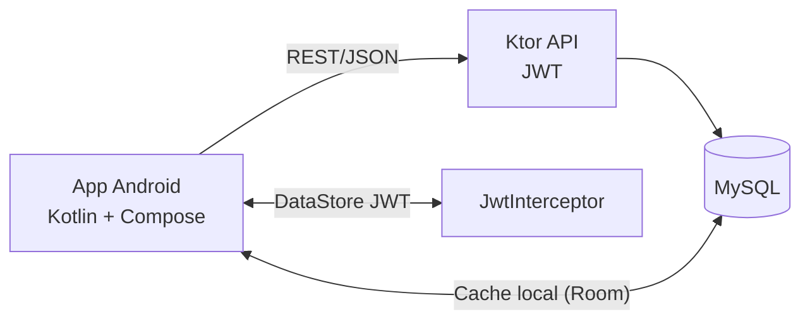
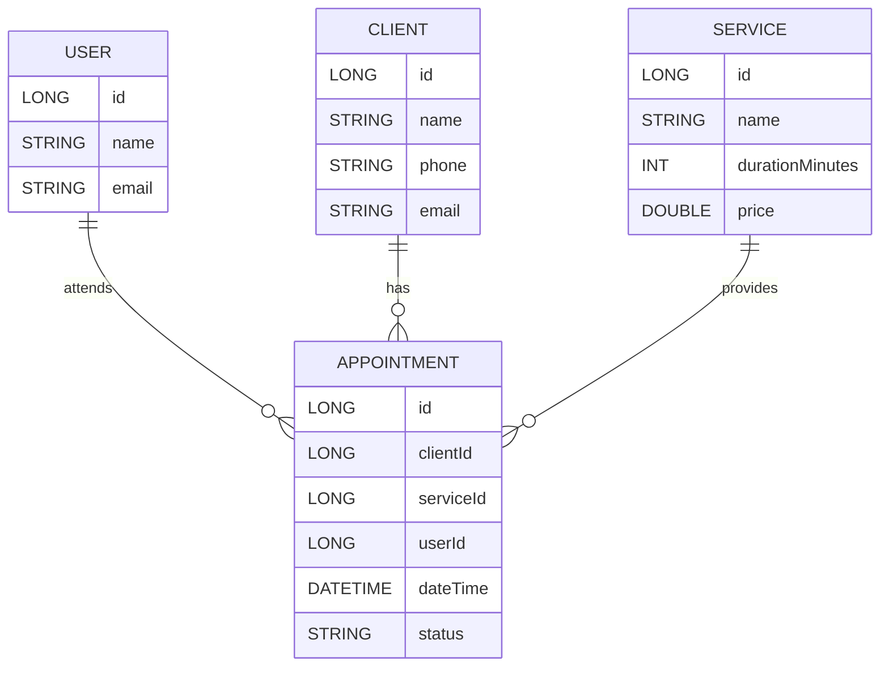

# Agenda360 Lite 
##### - Cliente Servidor

- #### Alumnos: Leonardo Alonso Aldana y Jennifer Rubi Hernandez Carrillo
- #### Universidad: Universidad Tecnologica de Mexico - UNITEC Campus Sur
- #### Carrera: Ingeniería en Sistemas Computacionales
- #### Equipo: 17
- #### Materia: Aplicaciones Moviles 360

Agenda360 Lite es una solución móvil para gestionar citas y servicios de negocios pequeños. El foco es la experiencia del usuario en Android (Kotlin + Jetpack Compose) y un backend en Ktor (Kotlin) con API REST y autenticación JWT.

**Qué obtienes:** una app moderna con inicio de sesión, dashboard del día, gestión de clientes y servicios, creación de citas con disponibilidad, y cambio de estado de citas; todo sobre una API limpia y documentada.

## Arquitectura



## Modelo de datos (resumen)



## Monorepo

```text
backend-ktor/       # API REST (Ktor + JWT)
Agenda360Lite/      # App Android (Compose + Hilt + Retrofit)
docs/               # Documentación y guías
```

## Navegación principal (app)

```mermaid
flowchart LR
  login((login)) --> dashboard((dashboard))
  dashboard --> appointmentForm((appointmentForm))
  dashboard --> appointmentDetail((appointmentDetail/{id}))
  dashboard --> clients((clients))
  dashboard --> services((services))
  dashboard --> profile((profile))
```

## API (v1)

- Autenticación: `POST /auth/login`, `POST /auth/register` (opcional)
- Clientes: `GET /clients`, `POST /clients`, `GET /clients/{id}`, `PUT /clients/{id}`
- Servicios: `GET /services`, `POST /services`, `GET /services/{id}`, `PUT /services/{id}`
- Citas: `GET /appointments?date=YYYY-MM-DD`, `POST /appointments`, `GET /appointments/{id}`, `PUT /appointments/{id}/status`
- Disponibilidad: `GET /appointments/availability?date=YYYY-MM-DD&serviceId=ID`

Envelope de respuesta:
```json
{ "data": {}, "error": null, "message": "OK" }
```

## Cómo usarlo

- Backend: ejecuta el servidor Ktor del módulo `backend-ktor` y revisa que la API responda en local.
- App Android: abre `Agenda360Lite` en Android Studio, ejecuta el módulo `app` en un emulador y realiza el flujo de inicio de sesión → dashboard.
- Postman: importa la colección en `backend-ktor/postman/` para verificar los endpoints clave.

## Experiencia de usuario (UX)

- Login: cabecera visual, inputs con iconos y validaciones.
- Dashboard: métricas del día (programadas / completadas / canceladas), lista de citas, estado vacío con CTA.
- Clientes/Servicios: búsqueda, paginación y edición.
- Citas: disponibilidad por servicio, creación, y cambio de estado.

## Buenas prácticas

- JWT nunca se guarda en repositorios públicos; se almacena en DataStore en la app.
- Configuración sensible (secretos y conexión) se maneja por variables de entorno en el backend (plantilla en `.env.example`), sin versionar.
- Manejo global de `401`: se limpia sesión y se regresa a login.

## Pruebas recomendadas

- Login y flujo protegido con JWT.
- CRUD de clientes y servicios (lista, alta y edición).
- Citas del día: creación, disponibilidad y cambio de estado.

## Estado actual

- Login + JWT: operativo.
- Dashboard: métricas y lista del día.
- Clientes/Servicios: búsqueda, paginación y alta/edición.
- Citas: disponibilidad, creación y actualización de estado.
- Próximo: Room, geolocalización y cámara para enriquecer el detalle.
